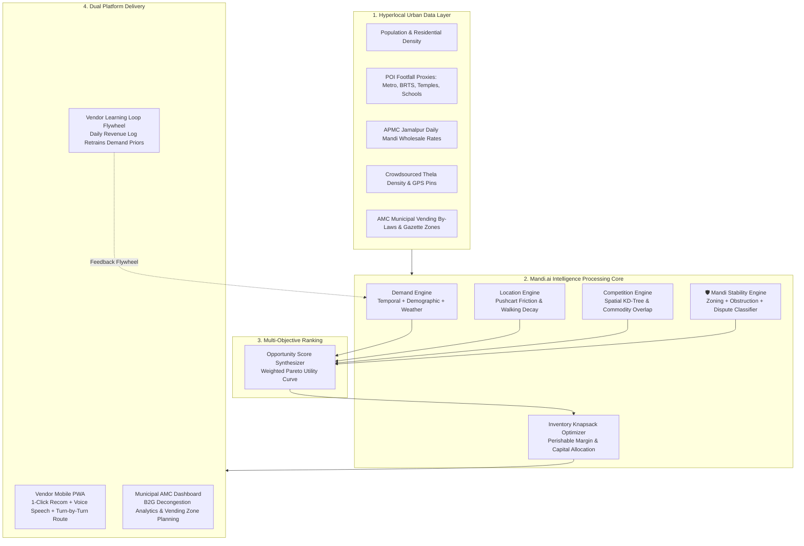

# 🥬 Mandi.ai (મંડી.એઆઈ)
### *AI-Powered Hyperlocal Geospatial Intelligence & Inventory Optimization for Street Vendors*

<div align="center">


<br/>

**“Turn every thela into a data-driven micro-business.”**

*Know what to sell • Know where to sell • Know when to sell*

[Live Demo](#-quickstart) • [Architecture](#-system-architecture) • [AI Scoring Formulations](#-the-5-core-ai-scoring-engines) • [Municipal B2G Suite](#-municipal-intelligence-suite-amc) • [Gujarati / Hindi Localization](#-inclusive-multilingual-ux--voice-assistance)

</div>

---

## 📖 Executive Summary & Problem Statement

Over **10 million street vendors** in India drive the backbone of informal urban retail, distributing over 65% of fresh fruits and vegetables to urban households. Yet, every morning at 5:00 AM, millions of thelawalas make high-stakes business bets based entirely on intuition and guesswork:

1. **Where should I place my thela today?**
2. **Which vegetables and fruits should I purchase at the wholesale APMC mandi?**
3. **What time will customers actually show up with purchasing intent?**
4. **Where are there already too many competing thelas selling the exact same tomatoes?**
5. **Will I face municipal confiscation, police warnings, or traffic conflicts at this corner?**
6. **Is traveling an extra 3 km with a 150 kg pushcart worth the physical effort and produce bruising?**

### The Consequence
- **Up to 25–35% unsold, spoiled produce** thrown away every evening due to perishable shelf-life.
- **Exhausting, blind travel** pushing heavy carts across high-traffic city arterials.
- **Constant friction with urban authorities** due to lack of visibility into designated vending corridors.

**Mandi.ai transforms this into a precise, explainable, data-driven daily recommendation.**

---

## 🎯 The Core User Experience

Every morning, the vendor opens **Mandi.ai** on their mobile phone and inputs two simple numbers:

$$\text{Budget: } ₹2,000 \quad|\quad \text{Commodity: } \text{Vegetables} \quad|\quad \text{Max Distance: } 5\text{ km}$$

Within 400 milliseconds, Mandi.ai synthesizes geospatial demographics, POI activity, road widths, competing vendor concentrations, and AMC municipal bylaws to deliver **Today's Actionable Recommendation**:

```
🥬 TODAY'S RECOMMENDATION
────────────────────────────────────────────────────────
📍 Location:        Isanpur (Govindwadi Market Corridor)
⏰ Best Time:       5:00 PM – 8:00 PM (Peak Footfall)
⭐ Opportunity:     91 / 100
📈 Demand Score:    94 / 100  (HIGH)
🛒 Competition:     LOW       (Only 3 nearby thelas)
🛡️ Stability:       88 / 100  (Official AMC Vending Belt)
🧭 Handcart ETA:    ~24 mins (1.4 km)

🛒 RECOMMENDED INVENTORY ALLOCATION (Budget: ₹2,000):
   🍅 Tomato         ₹400  (~22 kg)  │ Est. Return: ₹770  (APMC ₹18 → Retail ₹35)
   🥔 Potato         ₹350  (~21 kg)  │ Est. Return: ₹588  (APMC ₹16 → Retail ₹28)
   🧅 Onion          ₹300  (~13 kg)  │ Est. Return: ₹494  (APMC ₹22 → Retail ₹38)
   🍌 Banana         ₹300  (~12 doz) │ Est. Return: ₹540  (APMC ₹25 → Retail ₹45)
   🌿 Coriander      ₹150  (~5 kg)   │ Est. Return: ₹350  (APMC ₹30 → Retail ₹70)
   📦 Reserve        ₹500  (Leafy Greens & Packaging)
────────────────────────────────────────────────────────
💰 Expected Gross Turnover:  ₹3,450 – ₹3,600
💵 Projected Net Profit:     +₹1,450 to +₹1,600 (75%+ ROI)
```

---

## 🏗️ System Architecture

Mandi.ai is built with a dual-mode reactive architecture: a **mobile-first PWA frontend** designed for high contrast and sunlight readability, coupled with a **high-performance geospatial inference engine**.



---

## 🧮 The 5 Core AI Scoring Engines

### 1. 📈 Hyperlocal Demand Engine
Estimates customer purchasing velocity at location $L$ at time $T$ for commodity category $C$:

$$\text{DemandScore}(L, T, C) = \Big( w_{\text{res}} R_L + w_{\text{pop}} P_L + w_{\text{poi}} \sum \text{POI}_i + w_{\text{foot}} F_L \Big) \times \gamma(T) \times \beta(C)$$

Where:
- $R_L$: Residential density percentage (weights family kitchen cooking habits).
- $P_L$: Normalized population density per $\text{km}^2$.
- $\sum \text{POI}_i$: Nearby activity generators (schools, BRTS stops, Metro stations, temples, vegetable markets).
- $\gamma(T)$: Diurnal time-curve multiplier (calibrated for Ahmedabad evening rush: 5:00 PM – 8:00 PM).
- $\beta(C)$: Commodity factor (vegetables vs fruits vs leafy produce).

---

### 2. 🧭 Location & Accessibility Engine
Accounts for the physical labor and travel friction of pushing a 100–180 kg loaded wooden thela:

$$\text{AccessibilityScore}(L) = \max\Big(15,\, 100 - \alpha \cdot d(L, \text{Depot}) - \text{Penalty}_{\text{radius}}\Big)$$

Where:
- $d(L, \text{Depot})$: Haversine distance in kilometers from the vendor's starting point.
- Average thela walking speed is calibrated at **$3.5\text{ km/h}$**.
- $\text{Penalty}_{\text{radius}}$: Exponential decay penalty if distance exceeds vendor's selected maximum travel tolerance.

---

### 3. 🛒 Competition Intelligence Engine
Measures direct commodity cannibalization within an $800\text{m}$ walking catchment:

$$\text{CompetitionScore}(L) = \min\Big(95,\, \sum_{j \in \text{Nearby}} \omega(C_{\text{vendor}}, C_j) + 2.5 \cdot N_{\text{thelas}}\Big)$$

- Identical commodity overlap (e.g., selling tomatoes right next to another tomato cart) carries a heavy penalty multiplier ($1.5\times$).
- Complementary commodities (e.g., fruit thela next to a vegetable cart) carry minimal conflict penalties.

---

### 4. 🛡️ Mandi Stability Engine *(The Differentiating Feature)*
Rather than offering unrealistic legal guarantees, Mandi.ai computes an objective **Regulatory and Physical Stability Audit**:

$$\text{StabilityScore}(L) = 0.40 \cdot Z_{\text{AMC}} + 0.25 \cdot R_{\text{obstruction}} + 0.20 \cdot P_{\text{private}} + 0.15 \cdot C_{\text{conflict}}$$

Where:
- $Z_{\text{AMC}}$: AMC Municipal Zoning status:
  - 🟢 **Designated Green Vending Zone**: $95$ pts (Recognized by Ahmedabad Municipal Corporation).
  - 🟡 **Time-Restricted Amber Zone**: $70$ pts (Permitted only during specified off-peak hours).
  - 🔴 **Strict Red No-Vending Zone**: $15$ pts (Gujarat High Court transit corridors; active clearing drives).
- $R_{\text{obstruction}}$: Traffic and BRTS corridor bottleneck risk.
- $P_{\text{private}}$: Encroachment risk adjacent to corporate tech parks or private retail malls.
- $C_{\text{conflict}}$: Historical disturbance and territory friction index.

> **Transparent Legal Disclaimer:** *This is an AI/geospatial risk estimate based on municipal data and spatial proxies. It does not constitute a municipal vending license or legal guarantee of protection from eviction, enforcement, or private disputes.*

---

### 5. 💰 Master Opportunity Ranking & Multi-Objective Knapsack
Synthesizes all signals into the final decision metric:

$$\text{OpportunityScore} = w_1 \cdot \text{Demand} + w_2 \cdot \text{Accessibility} + w_3 \cdot \text{Stability} - w_4 \cdot \text{Competition} - w_5 \cdot \text{TravelCost}$$

#### Bounded Knapsack Produce Allocation ("What Should I Sell?")
Takes the vendor's working capital $B$ and allocates optimal lots across staple versus high-margin produce:

$$\max \sum_{i=1}^n \text{Profit}_i \times x_i \quad \text{s.t.} \quad \sum_{i=1}^n \text{WholesaleRate}_i \times x_i \le B - \text{Reserve}$$

Prioritizes:
1. **Staples (Potato, Onion, Tomato)**: Baseline sales volume guarantee.
2. **High-Margin Perishables (Banana, Coriander, Green Chilli)**: Maximizes daily profit margin.
3. **Locality Profiling**: Automatically shifts towards exotic fruits in affluent wards (Vastrapur, Satellite) and essential staples in industrial suburbs (Lambha, Ramol).

---

## 🗺️ Hyperlocal Ahmedabad Geospatial Grounding

Mandi.ai is pre-loaded with high-resolution geospatial datasets across 12 iconic Ahmedabad municipal wards:

| Ward / Locality | Zone | Characteristics & Profile | AMC Zoning Status | Base Demand | Prime Hours |
|---|---|---|---|:---:|:---:|
| **Isanpur** | South | Dense residential family neighborhoods, Govindwadi Market | 🟢 Green Zone | 91 / 100 | 5:00 PM – 8:00 PM |
| **Maninagar** | South | Kankaria Lake footfall, Railway Station commuter hub | 🟢 Green Zone | 95 / 100 | 4:30 PM – 8:30 PM |
| **Lambha** | South | Rapidly expanding suburb, underserved fresh produce | 🟢 Green Zone | 84 / 100 | 4:00 PM – 7:30 PM |
| **Ramol** | East | Working-class residential pocket near Ring Road | 🟡 Amber Zone | 78 / 100 | 5:00 PM – 8:00 PM |
| **Vastrapur** | West | IIM Ahmedabad, lake crowd, high fruit/salad demand | 🟡 Amber Zone | 89 / 100 | 7:30 AM & 5:00 PM |
| **Satellite / Shivranjani**| South-West | Affluent high-rise societies, premium margins | 🟡 Amber Zone | 88 / 100 | 5:00 PM – 9:00 PM |
| **Jamalpur** | Central | Wholesale APMC epicenter, severe pushcart overcrowding | 🟡 Amber Zone | 93 / 100 | 6:00 AM – 11:00 AM |
| **Kalupur Station** | Central | Central Railway Station, heavy traffic enforcement | 🔴 Red Zone | 86 / 100 | 7:00 AM – 1:00 PM |
| **Navrangpura** | West | Gujarat University campus, student snacks & fruits | 🟡 Amber Zone | 85 / 100 | 4:00 PM – 8:00 PM |
| **Chandkheda** | North | ONGC township, expanding northern middle-class hub | 🟢 Green Zone | 83 / 100 | 5:00 PM – 8:30 PM |
| **Naroda** | East | GIDC industrial worker evening market rush | 🟡 Amber Zone | 82 / 100 | 5:30 PM – 9:00 PM |
| **South Bopal** | West | Multi-storey modern residential complexes | 🟢 Green Zone | 86 / 100 | 5:00 PM – 8:30 PM |

---

## 🏛️ Municipal Intelligence Suite (AMC / Urban Planners)

Mandi.ai features a dedicated **B2G (Business-to-Government)** mode designed for municipal bodies like the **Ahmedabad Municipal Corporation (AMC)** and urban planners under the *Street Vendors (Protection of Livelihood and Regulation of Street Vending) Act*:

- **Decongestion Diagnostics**: Flags overcrowded bottleneck zones where pushcarts spill onto active BRTS bus lanes (e.g., Jamalpur Sardar Bridge, Kalupur Circle).
- **Food Desert Identification**: Discovers underserved residential wards with rapid population growth but zero organized vegetable stalls (e.g., Lambha, South Bopal extension).
- **Interactive Vending Zone Planner**: Urban planners can test and simulate declaring new legal pushcart zones with specific thela capacities, operating hours, and sanitation fee structures.

---

## 🗣️ Inclusive Multilingual UX & Voice Assistance

Street vendors in Ahmedabad have varying literacy levels. Mandi.ai provides:
1. **1-Click Language Switcher**: Full support for **English**, **ગુજરાતી (Gujarati)**, and **हिन्दी (Hindi)**.
2. **Web Speech API Audio Narration**: Tap **"Listen / સાંભળો"** to hear the daily recommendation read aloud naturally in Gujarati or Hindi without reading the screen.
3. **High-Contrast Street UI**: Designed with oversized touch buttons and high-contrast color coding for mobile phone use under bright outdoor Gujarat sunlight.

---

## 🔄 Vendor Learning Loop (Data Flywheel)

At the end of the day, the vendor takes 15 seconds to log:
- **Actual Revenue** (e.g., ₹3,450)
- **Unsold Produce** (e.g., 2 kg Tomato, 1 kg Potato)
- **Customers Served** (~70)
- **Spot Conditions** (Peaceful / Overcrowded / Police Warning)

### The Self-Reinforcing Flywheel
```
Vendor Sales Logged ──► Ground Truth Calibration ──► Adjusted Ward Demand Priors
        ▲                                                      │
        │                                                      ▼
More Vendor Adoption ◄── Higher Daily Profits ◄── Better Recommendations
```

---

## 🚀 Quickstart Guide

### Prerequisites
- Node.js (v18+)
- Python (3.10+)

### 1. Launch the Frontend Web App (PWA)
```bash
# Clone the repository
git clone https://github.com/anushkayerpude/mandi.ai.git
cd mandi.ai

# Install dependencies
npm install

# Start the Vite development server
npm run dev
```
Open **[http://localhost:3000](http://localhost:3000)** in your browser or mobile phone.

### 2. (Optional) Run the Python FastAPI Backend Microservice
```bash
# In a new terminal tab
cd backend

# Install Python dependencies
pip install -r requirements.txt

# Start the FastAPI engine with auto-reload
python -m uvicorn backend.main:app --reload --port 8000
```
- Interactive Swagger API Documentation: **[http://localhost:8000/docs](http://localhost:8000/docs)**
- ReDoc Explorer: **[http://localhost:8000/redoc](http://localhost:8000/redoc)**

---

## 💼 Business & Sustainability Model

- **B2C (Vendors)**: **Freemium**. Basic location recommendations are 100% free. Advanced inventory optimization, seasonal price forecasts, and priority corridor alerts available for an affordable ₹49/month.
- **B2G (Municipalities & Smart Cities)**: Enterprise spatial analytics subscriptions for Municipal Corporations (AMC, SMC, VMC) to automate vending zone compliance and reduce traffic disputes under the Street Vendors Act.
- **B2B Partnerships**: Aggregated demand forecasting for wholesale APMC traders, FMCG distributors, and agricultural logistics networks.

---

## 📜 Compliance & Ethics

- Designed in accordance with the **Street Vendors (Protection of Livelihood and Regulation of Street Vending) Act, 2014**.
- Zero predatory surveillance or vendor tracking; location data is pseudonymized and aggregated.
- Built to protect and formalize informal micro-livelihoods across urban India.

---

<div align="center">

**Mandi.ai** — Made with 💚 for Ahmedabad's Street Vendors and Urban Planners.

*Empowering Informal Commerce with AI & Geospatial Intelligence.*

</div>
